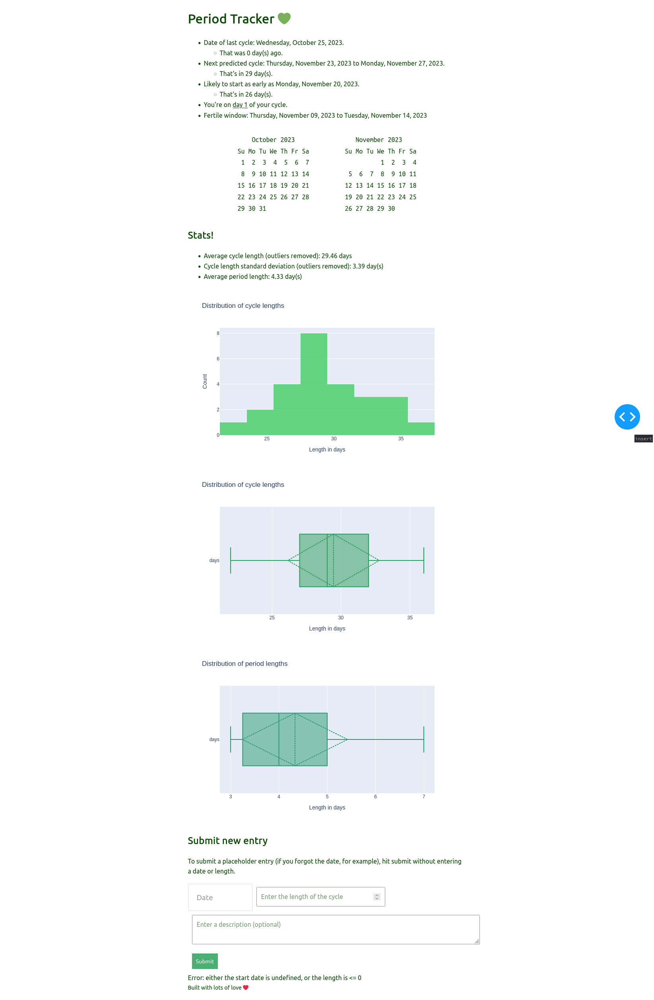

# Period Tracker

Here's a period tracker built with Python.
It's totally open source, and your data can just live on _your_ machine
as opposed to someone else's server.

## How to use it
You should probably first clone the repo.
After installing the necessary dependencies (probably `pandas`, `dash`, and `numpy`),
run `python app.py <filename>`.
This file should contain all the data you want as a CSV.
I've left a testing dataset called `data.csv` for a starter!

After running that, you'll get something like the following (based off some testing data):

# Future
More features coming soon! I'm looking to add better formatting for dates,
and having a way to supply files (I'm guessing people won't want to edit a CSV every time).
I'm also guessing people might want to track other symptoms, so I'll try to find a way
to incorporate/visualize that as well!
